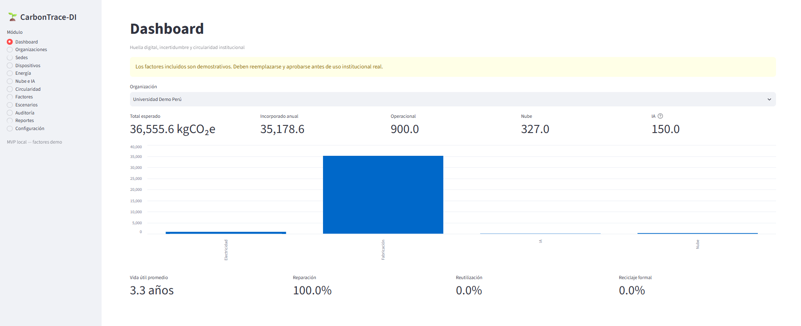
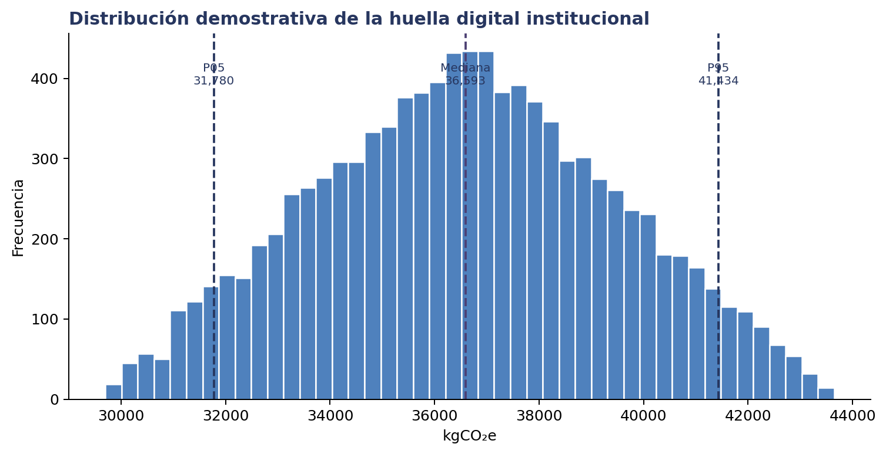
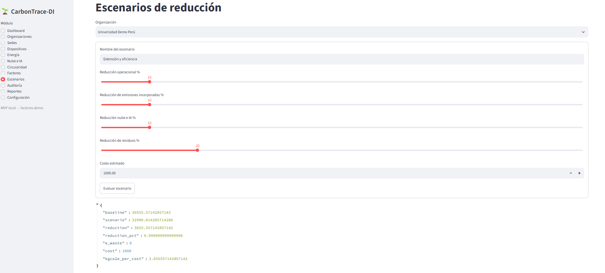

# CarbonTrace-DI

### Digital Carbon Footprint · Circularity · Uncertainty-Aware Sustainability Analytics

CarbonTrace-DI is a Python-based applied research and software-engineering prototype designed to estimate, organize and analyze the institutional digital carbon footprint of universities and organizations.

The system combines digital-device inventories, operational energy, cloud services, artificial intelligence workloads, electronic circularity, uncertainty analysis and reduction scenarios within a traceable analytical workflow.

This repository is a **public technical portfolio showcase**.

> The complete Python source code, databases, internal calculation modules and implementation components are maintained privately. This repository presents the architecture, verified behavior, analytical capabilities and selected visual evidence of the executed prototype.

---

## 🌍 The Problem

Digital transformation creates environmental impacts that are distributed across several sources:

- device manufacturing;
- electricity consumption;
- cloud computing;
- data transfer;
- artificial intelligence workloads;
- equipment replacement;
- electronic waste.

Organizations may track these components separately or rely on isolated estimates.

This makes it difficult to understand their combined digital environmental impact and to compare alternative reduction strategies.

CarbonTrace-DI addresses this problem through a structured, traceable and uncertainty-aware analytical system.

---

## 💡 What CarbonTrace-DI Does

The platform allows an organization to:

- register organizations and operational sites;
- inventory digital devices;
- estimate embodied carbon;
- analyze operational electricity consumption;
- register cloud and network activity;
- model artificial intelligence workloads;
- track repair, reuse and recycling events;
- evaluate electronic circularity;
- quantify uncertainty using Monte Carlo simulation;
- compare carbon-reduction scenarios;
- preserve calculation provenance;
- export institutional reports.

The objective is not only to estimate emissions.

The system is designed to support analytical comparison between alternatives while preserving the assumptions and evidence associated with each calculation.

---

## 🎯 Operational Question

CarbonTrace-DI explores the following decision problem:

> **What combination of device-life extension, energy efficiency, cloud/AI reduction and circularity can reduce digital environmental impact under traceable assumptions?**

---

## 🏗 High-Level Architecture

```text
Institutional Data
        │
        ▼
Organizations & Sites
        │
        ▼
Digital Asset Inventory
        │
        ├────────────────┐
        ▼                ▼
Energy Activity      Cloud / AI Activity
        │                │
        └────────┬───────┘
                 ▼
         Calculation Layer
                 │
                 ▼
        Uncertainty Analysis
            Monte Carlo
                 │
                 ▼
        Carbon + Circularity
              Results
                 │
         ┌───────┴────────┐
         ▼                ▼
 Reduction Scenarios   Provenance
                      + Integrity
         │                │
         └───────┬────────┘
                 ▼
 Dashboard · Excel · CSV · JSON
```

This diagram intentionally represents the system at architecture level.

Detailed source implementation remains private.

---

## 🧩 Functional Areas

### Organizations & Sites

Institutional context can be structured through organizations and operational locations.

The system supports contexts such as:

- universities;
- banking;
- software organizations;
- mining;
- construction;
- industry;
- other institutional environments.

---

## 💻 Digital Device Inventory

CarbonTrace-DI can manage grouped digital assets such as:

- laptops;
- desktops;
- monitors;
- servers;
- networking equipment;
- mobile devices.

Relevant information may include:

- category;
- quantity;
- nominal power;
- expected lifetime;
- embodied carbon;
- equipment weight;
- lifecycle status.

---

## ⚡ Operational Energy

Operational electricity consumption contributes to the institutional digital footprint.

CarbonTrace-DI prioritizes measured information when it is available.

When direct energy measurements are unavailable, analytical estimation can be performed using operational parameters and documented emission factors.

This distinction reduces the risk of silently mixing measured and estimated values.

---

## ☁️ Cloud & Network Activity

Digital environmental impact is not limited to physical devices.

The system also considers cloud-related activities including components such as:

- computing;
- storage;
- data transfer.

These activities can be incorporated into the analytical footprint according to the corresponding assumptions and emission factors.

---

## 🤖 Artificial Intelligence Workloads

Artificial intelligence activity can involve uncertainty that makes a single deterministic number misleading.

CarbonTrace-DI therefore supports the representation of AI-related impact through uncertainty ranges.

This provides a more transparent analytical treatment when exact consumption information is unavailable.

---

## ♻️ Electronic Circularity

CarbonTrace-DI separates carbon-footprint measurement from electronic circularity indicators.

This avoids collapsing different environmental concepts into a single arbitrary score.

Lifecycle events may include:

- failures;
- repairs;
- upgrades;
- reassignment;
- reuse;
- storage;
- retirement;
- formal recycling;
- donation.

This allows the environmental performance of digital assets to be analyzed from two complementary perspectives:

**Carbon Impact + Asset Lifecycle**

---

## 🎲 Uncertainty Analysis

Environmental calculations frequently contain uncertain inputs.

Instead of representing every value as perfectly known, CarbonTrace-DI includes uncertainty-aware analysis using Monte Carlo simulation.

The documented MVP supports simulation configurations such as:

```text
100
1,000
5,000
10,000 iterations
```

Simulation results can include:

- mean;
- median;
- standard deviation;
- P05;
- P95;
- sensitivity information.

This allows the system to report analytical ranges instead of false numerical precision.

---

## 🔍 Calculation Provenance

CarbonTrace-DI includes mechanisms designed to preserve the context behind an analytical calculation.

A calculation record may conceptually preserve:

```text
Input Snapshot
      +
Assumptions
      +
Calculation Context
      +
Integrity Metadata
```

SHA-256 is used as part of the documented integrity mechanism.

This provides traceability between analytical results and the information that generated them.

---

## 📉 Reduction Scenarios

The prototype can compare a baseline against alternative sustainability interventions.

Scenario analysis may include changes in:

- operational emissions;
- embodied carbon;
- cloud and AI activity;
- electronic waste;
- estimated implementation cost.

This allows questions such as:

> Which intervention provides the greatest estimated reduction under the available assumptions?

Scenario results can include indicators associated with:

- baseline;
- scenario result;
- absolute reduction;
- percentage reduction;
- remaining electronic waste;
- implementation cost;
- reduction per unit of cost.

---

## 📊 Dashboard

CarbonTrace-DI includes an interactive Streamlit dashboard.

The documented application was executed locally using synthetic institutional data.

The dashboard presents indicators associated with:

- expected total digital footprint;
- annualized embodied carbon;
- operational emissions;
- cloud impact;
- artificial intelligence impact;
- average device lifetime;
- repair;
- reuse;
- formal recycling.

---

## 📸 Visual Evidence

The following images correspond to the documented CarbonTrace-DI prototype and its analytical workflow.

### Institutional Digital Carbon Dashboard

The main dashboard consolidates the digital environmental profile of the selected organization.

It provides an integrated view of carbon-related and circularity indicators generated from the institutional dataset.



### Monte Carlo Uncertainty Analysis

CarbonTrace-DI incorporates Monte Carlo simulation to represent uncertainty in the estimated institutional digital footprint.

The distribution allows the analyst to evaluate uncertainty through statistics such as the mean, median and empirical P05-P95 interval.



### Reduction Scenario Analysis

The system supports comparison between the current baseline and alternative reduction strategies.

Scenario analysis can incorporate operational, embodied, cloud/AI and electronic-waste interventions together with estimated implementation costs.



These images provide visual evidence of the analytical system without requiring publication of the complete source implementation.

---

## 🖥 Application Workflow

A typical CarbonTrace-DI workflow is:

```text
1. Select or create an organization
            │
            ▼
2. Register sites and digital devices
            │
            ▼
3. Register energy, cloud and AI activity
            │
            ▼
4. Register circularity events
            │
            ▼
5. Review dashboard
            │
            ▼
6. Run uncertainty analysis
            │
            ▼
7. Compare reduction scenarios
            │
            ▼
8. Audit provenance
            │
            ▼
9. Export institutional reports
```

The workflow connects operational information with environmental analytics and decision support.

---

## 🛠 Technology Stack

### Core

Python 3.12+

### User Interface

Streamlit

### Data & Analytics

pandas · NumPy

### Persistence

SQLAlchemy 2.0 · SQLite

### Validation

Pydantic 2 · Domain Validation

### Reporting

pandas · openpyxl · Excel · CSV · JSON

### Uncertainty Analysis

Monte Carlo Simulation · Statistical Distributions

### Integrity

JSON Snapshots · SHA-256

### Testing

Pytest · pytest-cov

---

## 🧱 Software Architecture

The documented implementation separates responsibilities across several layers:

```text
Presentation
     │
     ▼
Application Services
     │
     ├────────────────┐
     ▼                ▼
Domain Logic       Persistence
     │                │
     ▼                ▼
Calculations        SQLite
Validation
Uncertainty
     │
     ▼
Provenance & Reports
```

This architecture separates business and calculation logic from presentation and persistence mechanisms.

---

## ✅ Software Verification

The documented MVP verification includes:

- **39 / 39 automated tests passed**
- **97% coverage in domain and service layers**
- SQLite database verification;
- report-export verification;
- local Streamlit execution;
- synthetic institutional data loading;
- navigation through the twelve principal application modules.

The interface was executed locally on Windows using Python 3.13.x and Streamlit 1.60.0.

These verification results correspond to the documented academic MVP and are not presented as certification of a production system.

---

## 📤 Institutional Reporting

CarbonTrace-DI can export structured analytical results.

### Excel

The documented institutional workbook may include:

- executive summary;
- inventory;
- energy;
- cloud;
- artificial intelligence;
- circularity;
- reduction scenarios;
- emission factors;
- methodological limitations.

### CSV

Structured operational and calculation outputs.

### JSON

Structured analytical information that can support reproducibility and integration.

---

## 📑 Example Reporting Structure

```text
Institutional Report
│
├── Executive Summary
│
├── Digital Inventory
│
├── Energy
│
├── Cloud
│
├── Artificial Intelligence
│
├── Circularity
│
├── Reduction Scenarios
│
├── Emission Factors
│
└── Methodological Limitations
```

This structure connects executive indicators with the supporting analytical information.

---

## 🧪 Synthetic Demonstration Data

The academic MVP includes synthetic datasets intended for controlled technical demonstration.

Documented contexts include examples related to:

- universities;
- banking;
- mining;
- construction.

Synthetic information allows the platform to be demonstrated without exposing confidential institutional information.

---

## 📈 Decision-Support Perspective

CarbonTrace-DI is designed as more than a standalone carbon calculator.

The analytical workflow combines:

```text
Measurement
     +
Estimation
     +
Uncertainty
     +
Circularity
     +
Scenario Analysis
     +
Provenance
     =
Decision Support
```

This provides a bridge between sustainability information and organizational decision-making.

---

## 🧠 Engineering Principles

The project applies several engineering principles:

### Separation of Responsibilities

Presentation, application services, domain calculations and persistence are separated.

### Traceability

Analytical outputs are associated with their assumptions and calculation context.

### Explicit Uncertainty

Uncertain information is represented analytically rather than hidden behind a single value.

### Reproducibility

Simulation configurations can use controlled random seeds.

### Local Processing

The documented MVP operates locally and does not require external calls for its core workflow.

### Controlled Scope

The software clearly distinguishes an academic MVP from a certified environmental reporting platform.

---

## 🔐 Public vs. Private Scope

### Publicly presented in this repository

✅ Project problem  
✅ Sustainability and business context  
✅ High-level architecture  
✅ Functional capabilities  
✅ Technology stack  
✅ Verified software metrics  
✅ General calculation methodology  
✅ General uncertainty methodology  
✅ Executed dashboard evidence  
✅ Monte Carlo evidence  
✅ Scenario-analysis evidence  
✅ Project documentation  

### Maintained privately

🔒 Complete Python source code  
🔒 Internal calculation modules  
🔒 Full database files  
🔒 Complete automated test suite  
🔒 Internal service implementation  
🔒 Configuration files  
🔒 Private datasets  
🔒 Internal scripts  
🔒 Detailed implementation documentation  

This separation allows technical and professional evaluation of CarbonTrace-DI without publicly distributing the complete software implementation.

---

## ⚠️ Scope & Limitations

CarbonTrace-DI is an **academic applied-research MVP**.

It is not presented as:

- an official greenhouse-gas inventory;
- an environmental certification system;
- a regulatory reporting platform;
- an externally certified carbon calculator;
- a production institutional deployment.

Emission factors used in demonstrations may be illustrative and must be replaced with verified institutional or authoritative factors before real-world use.

Controlled results should not be interpreted as certification or institutional environmental reporting.

The prototype is designed for:

**technical demonstration + experimental validation + analytical exploration**

---

## 🚀 Potential Evolution

Future development may include:

- integration with institutional ERP systems;
- automated energy-data ingestion;
- cloud-provider integrations;
- validated emission-factor catalogs;
- expanded lifecycle assessment;
- institutional authentication and roles;
- PostgreSQL deployment;
- API-based integrations;
- enhanced scenario optimization;
- real institutional pilot datasets;
- formal environmental methodology validation.

---

## 📚 Project Status

**Software:** v2.0.0  
**Documentation:** v2.0.2

**Status:** Suitable for controlled technical demonstration and experimental validation.

---

## 👤 Author

**Juan Miguel Alonso Cerna Saavedra**

Business Engineering  
Universidad Continental — Peru

### Areas of Interest

- Data & Business Analytics
- Business Intelligence
- Sustainability Analytics
- Decision Support Systems
- Python Software Engineering
- Operations Research
- Uncertainty Analysis
- Auditable Analytics

---

## 🌎 Professional Context

CarbonTrace-DI demonstrates how business analytics and software engineering can be applied to sustainability management.

The project connects:

**Business + Data Analytics + Sustainability + Software Engineering + Decision Support**

It illustrates the use of Python not only for calculation, but also for:

- structured data management;
- interactive dashboards;
- simulation;
- scenario analysis;
- uncertainty analysis;
- reporting;
- data provenance;
- traceability.

---

## 🎓 Academic Context

CarbonTrace-DI was developed as an academic applied-research and technological-development prototype.

The project demonstrates how concepts from Business Engineering can be connected with:

- operational data;
- sustainability;
- quantitative analysis;
- software development;
- information systems;
- organizational decision-making.

The documented MVP is suitable for controlled demonstration and experimental validation.

---

## 📫 Contact

[LinkedIn](https://www.linkedin.com/in/jmacerna)

GitHub: [@juanmiguelcerna](https://github.com/juanmiguelcerna)

---

## © Portfolio Notice

**Copyright © Juan Miguel Alonso Cerna Saavedra. All rights reserved.**

This repository is intended as a technical and academic portfolio showcase.

The complete source implementation is not distributed through this public repository.

No private databases, credentials, internal source modules or unpublished implementation components are included here.

---

**CarbonTrace-DI**

*Turning digital environmental data into traceable sustainability decisions.*
